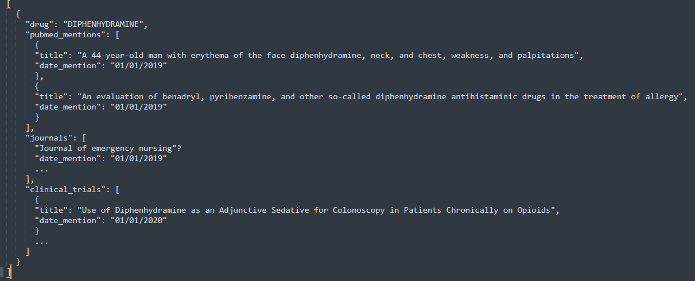

### Etapes pour effectuer l'exercice:

1) Lire l'énoncé
2) Ouverture des fichiers et analyse
3) Modéliser sur le papier le fichier JSON de sortie semblant le plus approprié avec des examples
Au début je pensais faire un fichier JSON plutôt de ce style:

Je pense que finalement, c'est un fichier JSON avec une liste de "Nodes" et "Edges" qui est attendu. 
4) Penser à la structure du projet répondant au besoin de l'exercice.
5) Coder et tester

### Faire tourner le code

Le fichier "output.json" est à la racine du projet si vous souhaitez regarder sans lancer.

Deux solutions pour lancer l'application principale:

#### Lancer directement le code Python

Au préalable créer l'environment virtuel et installer les dépendances (Poetry a été utilisé).

Commande à lancer depuis le dossier racine du projet:
```
python -m src.pipeline.main
```

Le fichier "output.json" créé se trouve à la racine du projet.

#### Lancer le code via docker

Un fichier docker se trouve à la racine du projet.

Il faut se placer à la racine du répo et puis lancer les commandes suivantes:
```
docker build -t my_app_test_image .
docker run my_app_test_image
```
Le fichier d'output sera présent dans les logs de sortie.

###  Traitement ad-hoc

Commande pour lancer depuis le dossier racine du projet:
```
python -m src.analyses
```
Le résultat se trouve dans les logs.

Il y a 2 journaux pour lesquels il y a le plus de "drugs" cités:
journal of emergency nursing    2
psychopharmacology              2


### Notes

L'architecture qui a été choisi est simple car le usecase l'est aussi. 

Habituellement, pour ce genre de projet l'architecture "Médaillon" (https://www.databricks.com/glossary/medallion-architecture) est adopté. 

L'orchestrateur va lancer une première étape qui va enregistrer les fichiers raws en base. Ensuite l'étape suivante est lancée, on charge les fichiers "raw" et les données sont filtrées, nettoyées et enrichies puis sauvegardés.
Enfin l'orchestrateur va lancer la dernière étape qui va charger les fichiers de la 2ème couche pour finaliser avec les règles métiers finale.

A chaque étape une discussion avec le business analyst est faite pour déterminer les règles adaptées par l'entreprise.

J'ai choisi de supprimer les lignes "Nan" ou vides, mais ce n'est peut-être pas la meilleure solution. J'ai aussi supprimé les chaînes "/x...".

Le cas d'utilisation est assez simple, c'est pourquoi je n'ai pas opté pour une approche orientée objet. J'ai décidé de simplement placer les bonnes fonctions dans des modules explicites.
Peut-être faut-il empaqueter le projet, créer un dépôt python-common ? Cela dépend du contexte.


### RAF

Général:
- Installer "pre-commit" et le  configuer avec le".pre-commit-config.yaml". Dans une équipe il est important que toutes les personnes de l'équipe ait les même règle de formattage. 
- Mettre en place la git action pour faire en sorte qu'à chaque "push" les test soient lancées
- Les accents ne sont pas bien traités

Sur la partie code:
- Gérer les cas spécificiques, par exemple si les fichiers reçus sont vides, peut-être après transformation, le fichier est vide.
- Sépcifier les fichier d'input avec des arguments tout comme le fichier de sortie
- Mettre en place plus de cohérences sur les minuscules majuscules dans le fichier de sortie
- Mettre en place des enums pour les types: journal, pubmed, clinical_triage, drug
- Mettre en place un mode debugging dans lequel on mettrait plus de logs
- Mettre en place un verificateur de schema (ex: pandora)
- Rendre le code plus lisible sur analyses (fonction/test)
- Faire un test d'intégration
- Compléter les tests unitaires, je ne les ai pas tous mis (notamment le module transform)


### Pour aller plus loin

Plusieurs solutions sont possibles:
- si il y a énormement de données il peut être intéréssant d'utiliser Spark pour effectuer les traitements de manière distribués.
- il peut être plus simple de traiter les données par mini-batch.
- utiliser la lecture fractionnée avec pandas, ou utiliser les daskframe.


### Exercice SQL

Question 1)

```
SELECT
    date,
    SUM(prod_price * prod_qty) AS ventes
FROM
    TRANSACTIONS
WHERE
    date BETWEEN '2019-01-01' AND '2019-12-31'
GROUP BY
    date
ORDER BY
    date;
```


Question 2)

```
SELECT
    t.client_id,
    SUM(CASE WHEN pn.product_type = 'MEUBLE' THEN t.prod_price * t.prod_qty ELSE 0 END) AS ventes_meuble,
    SUM(CASE WHEN pn.product_type = 'DECO' THEN t.prod_price * t.prod_qty ELSE 0 END) AS ventes_deco
FROM
    TRANSACTIONS t
JOIN
    PRODUCT_NOMENCLATURE pn ON t.prod_id = pn.product_id
WHERE
    t.date BETWEEN '2020-01-01' AND '2020-12-31'
GROUP BY
    t.client_id
ORDER BY
    t.client_id;
```